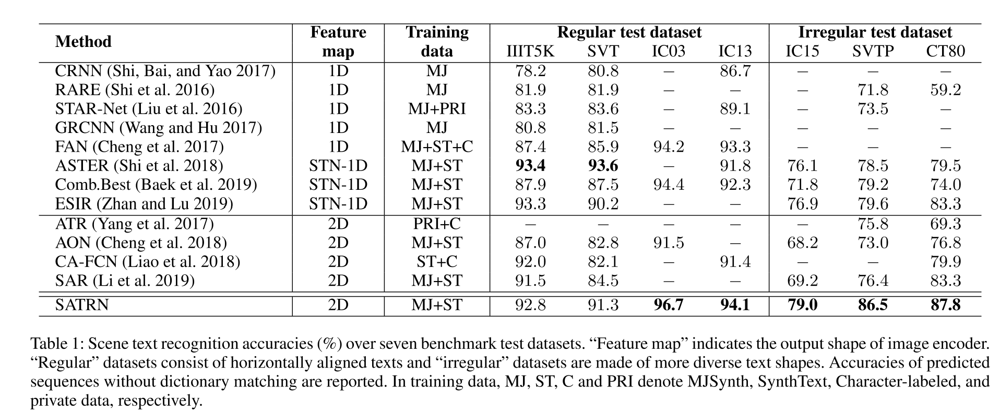

# 
**SATRN**

## Abstract
* 최근 Scene Text Recognition (a.k.a STR) 분야는 수많은 발전을 거듭하였지만 현존하는 메소드들은 여전히 휘어있거나 rotate 되어있는 등, arbitrary한 shape의 텍스트들을 잘 인식하지 못한다.
* SATRN (Self-Attention Text Recognition Network)는 self-attention mechanism을 활용하여 scene text image에 있는 character들의 two dimensional spatial dependency를 포착함.
* 결과적으로 arbitrary한 shape의 text들을 보다 더 잘 인식함.
* SATRN은 "irregular text" 벤치마크에서 기존의 STR 알고리즘들을 평균적으로 5.7pp만큼 앞섰음

## Introduction
* 기존에 STN에서 활용되던 CNN과 RNN을 결합한 메소드는 필드의 급격한 발전을 불러왔지만, 그들은 입력 텍스트가 horizontal하게 쓰여 있다는 가정에 기반하고 있음.
* 일부 메소드들에서는 2D CNN feature의 height component를 1D feature map으로 뭉개버림
* 이러한 이유로 기존의 메소드들은 개념적으로나 경험적으로나 arbitrary shaped text를 인식하는데 부적절하다고 볼 수 있음.
* 물론 이러한 image 타입을 다루기 위한 시도가 없던 것은 아니었음. 
* 크게 input rectificaiton, 2D feature map의 두 갈래로 연구가 진행되었음.
* 하지만, input rectification의 경우에는 가능한 transformation들의 집합이 사전에 정의되어 있어야 한다는 한계가 있었음.
* 2D feature map을 활용하는 method들은 여전히 input text들이 horizontal하게 쓰여졌다고 가정하거나, 모델 구조가 지나치게 복잡하거나, 혹은 ground truth character bounding box를 필요로 한다는 한계점이 있었음.
* SATRN은 image를 input으로 받아 output으로 text를 출력하는 cross modality task를 위한 Transformer의 Encoder-Decoder 구조를 도입함으로써 기존의 STR 모델들이 가진 문제점들을 해결함.
* SATRN의 Encoder에는 Transformer의 Encoder 구조에 Shallow CNN, Adaptive 2D Positional Encoding, Locality-Aware Feedforward Layer라는 새로운 모듈을 도입함.
  

## SATRN Method
* **Encoder**
  * 먼저 input image를 Shallow CNN을 통과하게 함으로써 local pattern과 texture를 포착할 수 있도록 함.
  * 다음으로 feature map은 Adaptive 2D Positional Encoding 모듈과 self attention 모듈을 통과한다. 이 때, self attention 모듈의 feedforward layer는 기존의 pointwise 방식이 아닌 Locality-Aware Feedforward 라는 새로운 방식의 layer임
  * self attention 블록은 번 반복된다.

  * **Shallow CNN block**
    * input image의 가장 원시적인 pattern과 texture를 추출한다.
    * visual data의 경우 suppress할 background feature들이 많기 때문에 더 높은 수준의 추상화를 필요로 함. 따라서, input을 Transformer에 그대로 적용하게 되면, 안 그래도 무거운 self attention 연산에 더 큰 부담을 주게 됨. 
    * shallow cnn은 이러한 부담을 줄이기 위한 pooling operation의 기능을 수행함.
    * Shallow CNN Block은 두 개의 3x3 conv layer와 stride 2의 2x2 max pooling layer로 구성되어 있음.
    * 최종적으로는 1/4 만큼 reduction이 진행됨. 이 이상으로 reduction ratio가 커질 경우 오히려 성능이 하락함.

  * **Adaptive 2D Positional Encoding**
    * Shallow CNN Block으로부터 추출된 feature는 self attention block으로 넘겨짐.
    * 하지만 self attention block은 input의 spatial arrangement를 고려하지 않음.
    * 이러한 이유로, original Transformer에서는 손실된 위치정보를 보충하기 위해 Positional Encoding 값을 더해줌.
    * Positional information은 일반적인 vision task에서 필수적인 부분이 아님. 하지만, arbitrary한 shape의 text를 recognition하는 부분에서는 상당히 중요한 역할을 함.
    * 따라서, SATRN에는 Positional Encoding을 2D로 확장한 모듈을 활용함.
    * 하지만, naive한 버전의 Positional Encoding로는 다양한 character arrangement를 다루는 것에 한계가 있음.
    * 따라서, Positional Encoding에는 input의 타입에 따라 다른 length element가 사용되어야 한다.
    * SATRN에서는 이러한 문제 역시 해결하기 위해 input에 따라 height와 width ratio를 dynamic하게 결정하기 위해 Adaptive 2D Positional Encoding이라는 방법을 제시함
    * Adaptive 2D Positional Encoding은 로 나타낼 수 있음.
    * 이 때, scale factor 와 는 input feature map 에 대하여 global average pooling을 거친 뒤 2-layer의 perceptron을 통과하여 계산된다.
    * 이를 수식으로 표현하면 다음과 같다.
    * 
    * 

  * **Locality Aware Feedforward Layer**
    * 좋은 STR performance를 위해서는 long range dependency 뿐만이 아니라 한 single characters에 대한 local vicinity 또한 다룰 수 있어야 함.
    * self attention layer는 long term dependency를 다루는 데는 유리하지만 local structure를 다루는 것에 약점이 있음.
    * 따라서, SATRN에서는 두 개의 1x1 convolution(Dense layer 와 동일)로 구성된 기존의 Pointwise Feedforward Layer를 3x3 convolution layer로 대체한 Locality Aware Feedforward Layer를 사용.
  
  ## Experiment
  * 실험은 네 가지 측면을 고려하여 진행됨
  * 첫 째, state of art model과의 정확도 비교
  * 둘 째, 연산 효율성 분석
  * 셋 째, 주요 모듈들에 대한 ablation study
  * 마지막으로, 기존의 데이터셋에 비해 더 높은 난이도의 case에 대한 실험
  * **STR Benchmark Datasets**
    * 7개의 benchmark dataset이 사용되었고 이들은 크게 regular와 irregular 두 개의 그룹으로 나눠짐
    * regular dataset의 경우는 horizontally aligned text들을 포함.
    * irregular benchmark는 왜곡되어있는 text들을 포함.
  * **Compare against Prior STR Methods**
      
    * Table 1에서 기존의 STR 모델과 SATRN을 상세히 비교함
    * 모델들은 feature map의 dimensionality와 Spatial Transformer Network 적용 여부에 따라 grouped 되어있음
    * SATRN은 2D feature map을 input으로 받는 다른 모델들과 비교해서 더 높은 성능을 보임
    * 특히, SATRN이 초점을 맞췄던 irregular benchmark에서는 평균 4.7pp의 큰 점수차로 2위 솔루션을 앞지름
  * **
